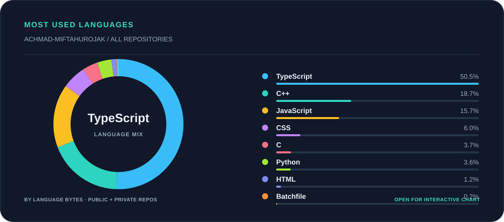

# Achmad Miftahurrojak

  

 

Embedded Systems & IoT Engineer

Building field-ready monitoring and early-warning systems with microcontrollers, sensors, and reliable communication links.

[Projects](#selected-projects) · [Most used languages](#most-used-languages) · [GitHub](https://github.com/achmad-miftahurrojak) · [Contact](#contact)

---

## What I build

I work on small embedded systems that measure real conditions, make a local decision, and deliver an alert when it matters. My current portfolio covers water quality, electrical outages, forest-fire risk, and small developer tools.

## Selected projects

| Project | What it does | Core stack |
| --- | --- | --- |
| [Water Quality Monitor](https://github.com/achmad-miftahurrojak/water-quality-monitor) | Samples TDS, pH, and turbidity, then logs and displays readings. | ESP32 · C++ · PlatformIO |
| [Power Outage Predictor](https://github.com/achmad-miftahurrojak/power-outage-predictor) | Classifies AC voltage states and sends an SMS when an outage is detected. | ESP32 · C++ · ZMPT101B · GSM |
| [Forest Fire Early Warning](https://github.com/achmad-miftahurrojak/forest-fire-early-warning) | Sends environmental readings from LoRa nodes to an alert hub. | ESP32 · C++ · LoRa · SIM800L |

Each hardware repository includes an architecture note, firmware layout, build commands, and configuration boundaries for local secrets.

## Most used languages

[Open the interactive chart ↗](https://achmad-miftahurrojak.github.io/achmad-miftahurrojak/)

The preview links to an interactive chart. Its donut animates while in view, pauses off-screen, and highlights each language on hover. The weekly workflow includes private repositories when the `GH_STATS_TOKEN` Actions secret has read access to them; otherwise the chart uses only public repositories.

## Contact

[GitHub](https://github.com/achmad-miftahurrojak) · [Instagram](https://instagram.com/hamiiin.n) · [Email](mailto:rozakahmadmiftahur@gmail.com)

I enjoy gaming, cinematography, and reading novels in my free time.
